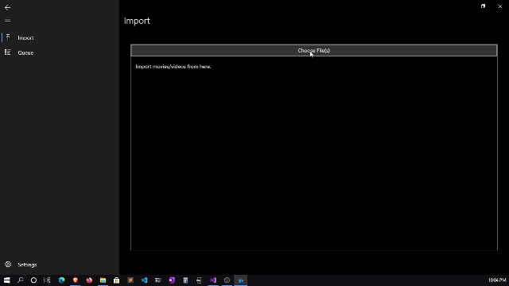
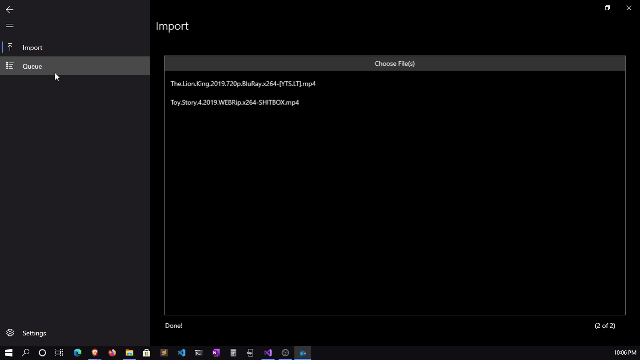
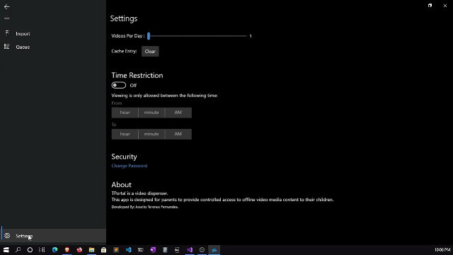
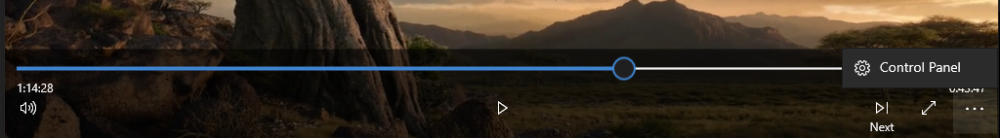

    

  <h1 align="center">TPortal</h1>

  

    TPortal is a video dispenser.  
    This app is designed for parents to provide controlled access to offline video media content to their children.
  

 

## 🚀 Demo
Try the application : [Download Installer](./TPortal-Installer).  
[Steps for Installation](#installation)

## 📚 About The Project 

TPortal is a video dispenser.  
This app is designed for parents to provide controlled access to offline video media content to their children.  
Once a video has been watched it is deleted.

## 🧐 Features
* First Launch Setup  

* Import videos  

* View Queue and delete from queue  

* Settings  
  1. No. of videos per day
  2. Time Restrictions (setup timings for viewing)
  3. Change Control Panel Password

  

* Custom Media Controls  
    
  (Clicking next allows for viewing of next video in the queue.)

## 💻 Built With
* UWP
* C#
* XAML

## 🛠️ Installation <a name='installation' />
1. [Download Installer](./TPortal-Installer) 
2. Install the Security Certificate (.cer file)
3. To install, Run Installer.appinstaller

## TPortal ™

